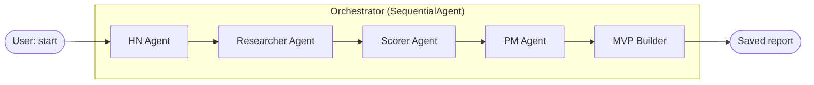
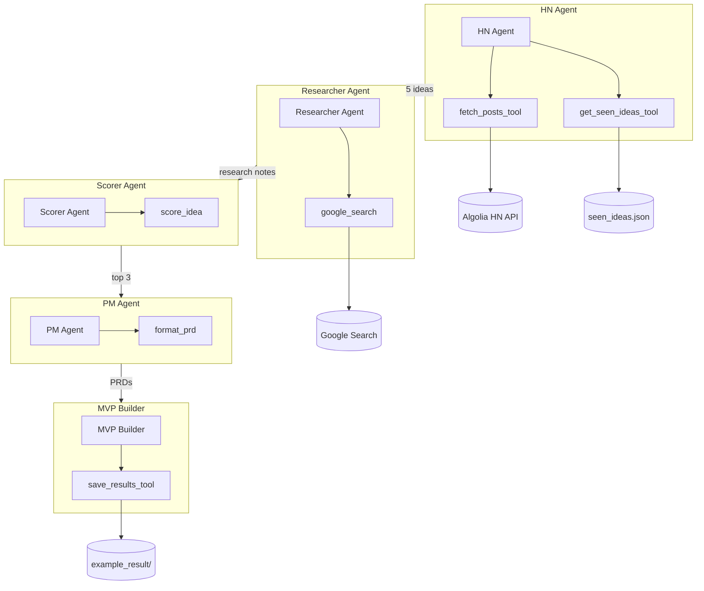
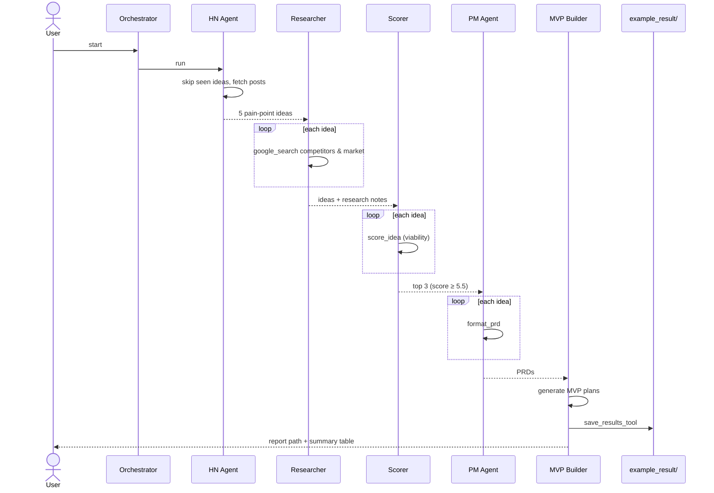

# Product Ideas Daily 🚀

An AI pipeline that scans Hacker News for pain points, validates ideas, writes PRDs, and generates MVP starter plans — powered entirely by Google Gemini via the Agent Development Kit (ADK).

## Pipeline

A `SequentialAgent` orchestrator runs five specialized agents in a fixed order. Each agent's output feeds the next.



### What each agent does

| Step | Agent | Role | Output |
|------|-------|------|--------|
| 1 | **HN Agent** | Scans Hacker News for pain points and complaints | Top 5 raw product ideas |
| 2 | **Researcher Agent** | Validates ideas via Google Search (competitors, market signals) | Research notes per idea |
| 3 | **Scorer Agent** | Scores viability and filters weak ideas | Top 3 ideas (score ≥ 5.5) |
| 4 | **PM Agent** | Writes scoped PRDs for survivors | Structured PRDs |
| 5 | **MVP Builder** | Generates starter plans and saves results | MVP plans + summary table |

### Tools & external services



> **Why two research steps?** Gemini does not allow built-in tools (`google_search`) and custom function tools (`score_idea`) in the same agent request. The researcher handles web search; the scorer handles deterministic scoring.

### Data flow (one run)



## Requirements

- Python 3.12+
- Google Gemini API key (used by every agent)

That's it — the Hacker News source uses the free, open [Algolia HN Search API](https://hn.algolia.com/api), so it needs **no API key, no account, and no approval**.

## Setup

```bash
# 1. Clone the repo
git clone <your-repo>
cd product-ideas-agent

# 2. Install dependencies
uv sync

# 3. Set up environment variables
cp .env.example .env
# Edit .env and add your GEMINI_API_KEY

# 4. Run
adk web
```

Then open the browser, type **"start"** and watch the pipeline run.

## Environment Variables

| Variable | Description |
|----------|-------------|
| `GEMINI_API_KEY` | Google Gemini API key (powers all agents) |

Get a key from [Google AI Studio](https://aistudio.google.com/apikey).

## Project Structure

```
product-ideas-agent/
├── agents/
│   ├── orchestrator.py          # Sequential pipeline runner
│   ├── hn_agent/                # Fetches Hacker News posts
│   │   ├── __init__.py          #   thin re-export
│   │   └── agent.py             #   agent + tool definition
│   ├── researcher_agent/        # Validates ideas via Google Search
│   ├── scorer_agent/            # Scores viability, filters to top 3
│   ├── pm_agent/                # Writes PRDs
│   └── mvp_builder_agent/       # Generates MVP plans
├── tools/
│   ├── hackernews_tool.py       # Free Algolia HN Search API wrapper
│   └── storage.py               # Saves runs + "seen ideas" memory
├── example_result/              # Saved run outputs (.json/.md) + seen_ideas.json
├── config.py                    # Typed settings (pydantic-settings)
├── constants.py                 # HN tags, model, thresholds
├── main.py                      # ADK entry point
├── pyproject.toml
└── .env.example
```

## Configuration

All tunable knobs live in [`constants.py`](constants.py):

```python
GEMINI_MODEL = "gemini-2.5-flash-lite"      # swap the model everywhere
DEFAULT_HN_TAGS = ["ask_hn", "show_hn"]     # which HN feeds to scan
DEFAULT_POST_LIMIT = 10                      # posts per tag
DEFAULT_LOOKBACK_DAYS = 7                    # how far back to look
VIABILITY_THRESHOLD = 5.5                    # lower to pass more ideas, raise to be stricter
```

The Gemini API key is read via [`config.py`](config.py) (typed `pydantic-settings`),
which loads from your `.env` file automatically.

> **Free-tier note:** the defaults are intentionally small to stay under Gemini's
> free-tier rate limit (~10 requests/min). If you hit `429 RESOURCE_EXHAUSTED`,
> wait a minute and rerun, lower these further, or enable billing. `flash-lite`
> is used for the most throughput; bump `GEMINI_MODEL` to `gemini-3.5-flash` for
> higher quality once you have headroom.

## Results & memory

Each run is saved to `example_result/` as both `.json` and `.md` (timestamped),
so you build a growing library of ideas. Product names are also recorded in
`example_result/seen_ideas.json`, and the HN agent checks this on every run to
**skip ideas it has already surfaced** — so repeat runs produce fresh ideas
instead of the same ones.
